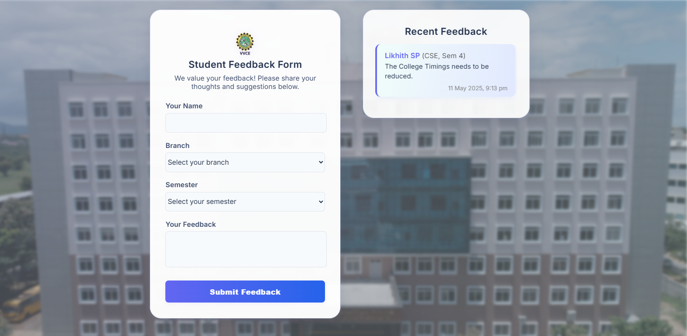

# VVCE Student Feedback Form

<strong>A modern web app for collecting student feedback at VVCE, with secure authentication and auto-filled forms using Supabase as the backend.</strong>

---

## Features
- **Student authentication** using VVCE email (auto-generated from USN)
- **Registration** with USN, name, branch, and semester (auto-validates VVCE format)
- **Auto-fills feedback form** with student profile data
- **Secure feedback storage** in Supabase with Row Level Security (RLS)
- **Recent feedback** panel (shows all feedback, not just your own)
- **Modern, responsive design** matching the VVCE website
- **Logout** and session management

---

## How VVCE Students Can Use This App

### 1. Register (Create an Account)
IMP : Make sure you use 4VV23CS"your-clg-email-no" for the USN 
- Go to the registration page (`register.html`).
- Enter your **USN** (e.g., `4VV23CS233`), full name, select your branch and semester, and set a password.
- The system will automatically generate your VVCE email (e.g., `vvce23cse0233@vvce.ac.in`) from your USN.
- After successful registration, your profile is securely stored in Supabase.

### 2. Login
- Go to the login page (`login.html`).
- Enter your **USN** and password.
- The system will convert your USN to the correct VVCE email and log you in.
- If you forget your password, use the Supabase password reset (if enabled by admin).

### 3. Give Feedback
- After logging in, you'll be redirected to the main feedback form (`index.html`).
- Your **name, branch, and semester** will be auto-filled and read-only.
- Enter your feedback message and click **Submit Feedback**.
- Your feedback will appear instantly in the **Recent Feedback** panel and is stored in Supabase.

### 4. Logout
- Click the **Logout** button at the top left to end your session securely.

---

## Project Setup (For Developers)

1. **Clone or download this repository.**
2. **Create a Supabase project** and run the provided `setup-database.sql` to create tables, RLS policies, and triggers.
3. **Update `supabaseConfig.js`** with your Supabase URL and anon key.
4. **Deploy to Netlify or your preferred static host.**

### Database Schema & Security
- Uses two tables: `student_profiles` (for user data) and `student_feedback` (for feedback).
- RLS policies ensure students can only write their own data, but all feedback is visible for transparency.
- A trigger automatically creates a profile when a new user registers.

### Main Files
- `index.html` — Main feedback form (auto-fills profile, shows feedback)
- `register.html` — Registration page (USN-based, VVCE email logic)
- `login.html` — Login page (USN-based, VVCE email logic)
- `auth.js` — Handles authentication and session
- `feedback.js` — Handles feedback submission and display
- `profileManager.js` — Centralizes profile fetching/auto-fill logic
- `setup-database.sql` — All SQL for tables, RLS, and triggers

---

## FAQ

**Q: Who can register?**  
A: Only students with a valid VVCE USN (e.g., `4VV23CS115`).

**Q: What if my feedback doesn't show up?**  
A: Make sure you are logged in. If you see errors, try logging out and back in, or contact the admin.

**Q: Is my data secure?**  
A: Yes. All data is protected by Supabase Row Level Security. Only you can write your profile/feedback, but all feedback is visible to everyone for transparency.

---

## License
MIT
